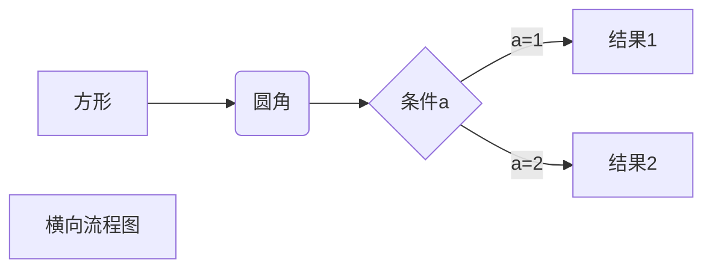
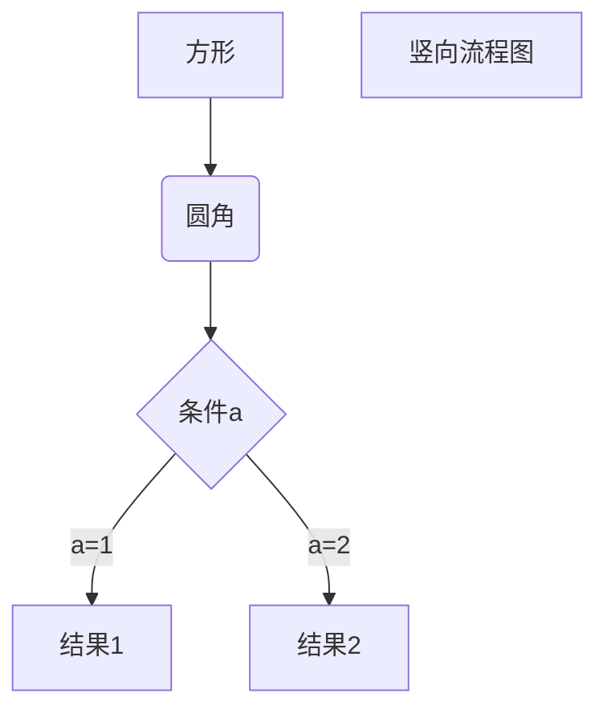
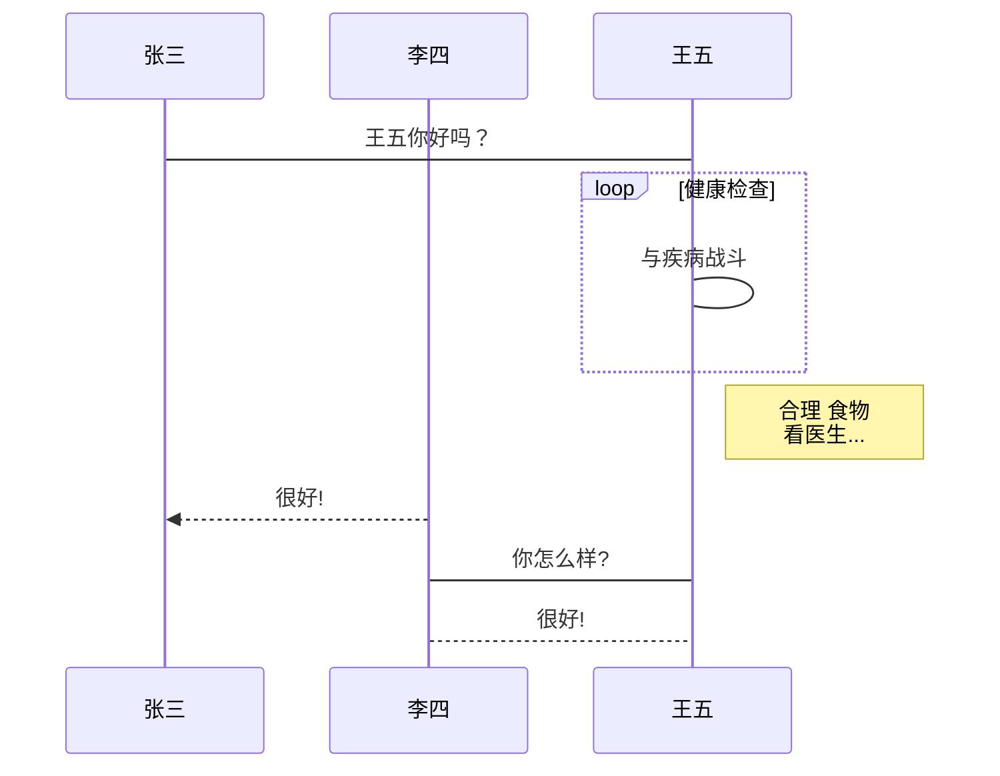
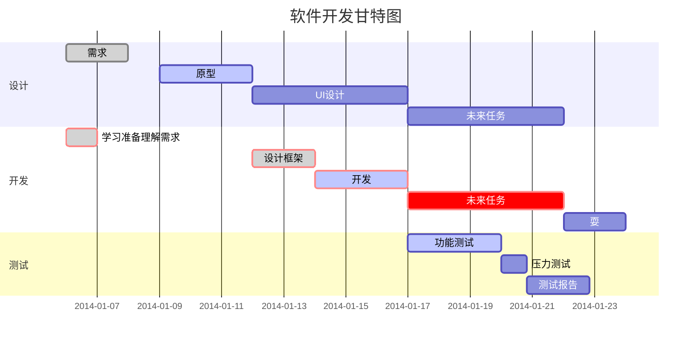

## Markdown概述 ##

1. Markdown是一种轻量级标记语言，它允许人们使用易读易写的纯文本格式编写文档。
2. Markdown编写的文档可以导出HTML，word，图像，PDF，epub等多种格式的文档。
3. Markdown编写的文档后缀为.md，.markdown。

（注意：使用typora编辑器来编写Markdown，typora支持macOS，windows，Linux平台，支持导出HTML，PDF，word，图片等多种类型文件。）


## Markdown标题 ##

Markdown标题有两种格式：

##### 1. 使用 = 和 - 标记一级和二级标题。 #####

##### 2. 使用#号标记：使用#号可表示1-6级标题。 #####


## Markdown段落 ##

Markdown段落没有特殊的格式，直接编写文字就好，有两种格式：

##### 1. 段落的换行是使用两个以上的空格加上回车。 #####

##### 2. 当然也可以在段落后面使用一个空行来表示重新开始一个段落。 #####


## Markdown字体

##### 1. Markdown可以使用以下三种字体：

     ##### 1. 斜体文本：内容两侧使用*号或_包住。

##### 2. 粗体文本：内容两侧使用**号或__包住。

##### 3. 粗斜体文本：内容两侧使用***号或___包住。


## Markdown分隔线

Markdown分隔线有三种：可以在一行中用三个以上的星号，减号，底线来建立一个分隔线，行内不能有其他东西。也可以在星号或是减号中间插入空格。


## markdown删除线

如果段落上的文字要添加删除线，只需要在~~文字~~的两端加上两个波浪线~~即可。


## Markdown下划线

<u>下划线</u>可以通过HTML的<u>标签来实现。


## markdown脚注

脚注是对文本的补充说明。Markdown脚注的格式：[^要表明的文本]

例子：

创建脚注格式类似这样[^RUNOOB]

[^RUNOOB]: 学的不仅是技术，更是梦想！！！


## markdown列表

Markdown支持有序列表和无序列表：

##### 1. 无序列表使用*号，+号或是减号-作为列表标记，这些标记后要添加一个空格，然后再填写内容。

##### 2. 有序列表使用数学加上.号来表示。


## Markdown列表嵌套

列表嵌套只需在子列表中的选项前面添加四个空格即可。


## Markdown区块

Markdown区块引用是在段落开头使用>符号，然后后面紧跟一个空格符号。

另外区块是可以嵌套的，一个>符号是最外层，两个>符号是第一层嵌套，依次类推。

##### 1. 区块中使用列表例子：

> 区块中使用列表
>
> 1. 第一项
> 2. 第二项
>
> + 第一项
> + 第二项

##### 2. 列表中使用区块：

+ 第二项

  > 列表中使用区块

+ 第二项

  > 列表中使用区块


## Markdown代码

如果是段落上的一个函数或片段的代码可以用反引号把它包起来，例如：`print()`。


## markdown代码区块

markdown代码区块有两种格式：

##### 1. 使用4个空格或者一个制表符（tab键）。

##### 2. 也可以使用```包裹一段代码，并指定一种语言（也可以不指定）。

例如：

```javascript
$(document).ready(function () {
    alert('RUNOOB');
});
```


## markdown链接

链接使用方法如下：

```
[链接名称](链接地址)
或者
<链接地址>
```

例如：

这是一个链接 [菜鸟教程](https://www.runoob.com)

<https://www.runoob.com>

## markdown高级链接

可以通过变量来设置一个链接, 变量赋值在文档末尾进行. 例如:

```
这个链接用1作为网址变量 [Goole][1]
这个链接用runoob作为网址变量 [Runoob][runoob]
[1]: http://www.google.com/
[runoob]: http://www.runoob.com/
```

这个链接用1作为网址变量 [Goole][1]
这个链接用runoob作为网址变量 [Runoob][runoob]

[1]: http://www.google.com/
[runoob]: http://www.runoob.com/


## Markdown图片

Markdown图片语法格式如下:

```

或者

```

 例如:


## Markdown高级图片

也可以像网址那样对图片网址使用变量:

```
这个链接用1作为网址变量 [RUNOOB][1].
然后在文档的结尾为变量赋值(网址)
[1]: http://static.runoob.com/images/runoob-logo.png
```

这个链接用1作为网址变量 [RUNOOB][1].
然后在文档的结尾为变量赋值(网址)

[1]: http://static.runoob.com/images/runoob-logo.png

注意: Markdown还没有办法指定图片的高度与宽度, 如果需要的话, 可以使用普通的标签.

```

```


## Markdown表格

Markdown制作表格使用|来分隔不同的单元格,使用-来分隔表头和其他行. 语法格式如下:

```
|表头|表头|
|----|----|
|单元格|单元格|
|单元格|单元格|
```

| 表头   | 表头   |
| ------ | ------ |
| 单元格 | 单元格 |
| 单元格 | 单元格 |

##### 对齐方式:

- `-:`设置内容和标题栏居右对齐.
- `:-`设置内容和标题栏居左对齐.
- `:-:`设置内容和标题栏居中对齐.

```
|左对齐|右对齐|居中对齐|
|:----|----:|:----:|
|单元格|单元格|单元格|
```

| 左对齐 | 右对齐 | 居中对齐 |
| :----- | -----: | :------: |
| 单元格 | 单元格 |  单元格  |


## Markdown高级技巧

##### 1. 支持的HTML元素

不在Markdown涵盖范围之内的标签,都可以直接在文档里面用HTML撰写.

目前支持的HTML元素有: `<kbd> <b> <em> <sup> <sub> <br>`等, 例如:

使用 <kbd>Ctrl</kbd>+<kbd>alt</kbd>+<kbd>del</kbd> 重启电脑.

<b>哈哈哈</b>

<em>哈哈哈</em>

<sub>哈哈哈</sub>

<sup>哈哈哈</sup>

<br>哈哈哈

##### 2. 转义

Markdown使用了很多特殊符号来表示特定的意义,如果需要显示特定的符号则需要使用转义字符,Markdown使用反斜杠转义特殊字符:

```
**文本加粗**
\*\*正常显示星号\*\*
```

**文本加粗**
\*\*正常显示星号\*\*

Markdown支持以下这些符号前面加上反斜杠来帮助插入普通符号:

```
\    反斜杠
`    反引号
*    星号
_    下划线
{}    花括号
()    小括号
[]    方括号
#    井字号
-    减号
.    英文句点
!    感叹号
```

##### 3. 公式

当需要在编辑器中插入数学公式时,可以使用两个美元符$$包裹Tex或LaTeX格式的数学公式来实现. 提交后, 问答和文章会根据需要加载mathjax对数学公式进行渲染. 例如:
$$
\mathbf{V}_1\times \mathbf{V}_2
$$


## typora画流程图, 时序图(顺序图), 甘特图

##### 1. 横向流程图源码格式:

```
​```mermaid
graph LR
A[方形] -->B(圆角)
    B --> C{条件a}
    C -->|a=1| D[结果1]
    C -->|a=2| E[结果2]
    F[横向流程图]
```




##### 2. 竖向流程图源码格式:

```
​```mermaid
graph TD
A[方形] --> B(圆角)
    B --> C{条件a}
    C --> |a=1| D[结果1]
    C --> |a=2| E[结果2]
    F[竖向流程图]
```



##### 3. 标准流程图源码格式：

```
​```flow
st=>start: 开始框
op=>operation: 处理框
cond=>condition: 判断框(是或否?)
sub1=>subroutine: 子流程
io=>inputoutput: 输入输出框
e=>end: 结束框
st->op->cond
cond(yes)->io->e
cond(no)->sub1(right)->op
```

```flow
st=>start: 开始框
op=>operation: 处理框
cond=>condition: 判断框(是或否?)
sub1=>subroutine: 子流程
io=>inputoutput: 输入输出框
e=>end: 结束框
st->op->cond
cond(yes)->io->e
cond(no)->sub1(right)->op
```

##### 4. 标准流程图源码格式（横向）：

```
​```flow
st=>start: 开始框
op=>operation: 处理框
cond=>condition: 判断框(是或否?)
sub1=>subroutine: 子流程
io=>inputoutput: 输入输出框
e=>end: 结束框
st(right)->op(right)->cond
cond(yes)->io(bottom)->e
cond(no)->sub1(right)->op
```

```flow
st=>start: 开始框
op=>operation: 处理框
cond=>condition: 判断框(是或否?)
sub1=>subroutine: 子流程
io=>inputoutput: 输入输出框
e=>end: 结束框
st(right)->op(right)->cond
cond(yes)->io(bottom)->e
cond(no)->sub1(right)->op
```

##### 5. UML时序图源码样例：

```
​```sequence
对象A->对象B: 对象B你好吗?（请求）
Note right of 对象B: 对象B的描述
Note left of 对象A: 对象A的描述(提示)
对象B-->对象A: 我很好(响应)
对象A->对象B: 你真的好吗？
```

```sequence
对象A->对象B: 对象B你好吗?（请求）
Note right of 对象B: 对象B的描述
Note left of 对象A: 对象A的描述(提示)
对象B-->对象A: 我很好(响应)
对象A->对象B: 你真的好吗？
```

##### 6. UML时序图源码复杂样例：

```
​```sequence
Title: 标题：复杂使用
对象A->对象B: 对象B你好吗?（请求）
Note right of 对象B: 对象B的描述
Note left of 对象A: 对象A的描述(提示)
对象B-->对象A: 我很好(响应)
对象B->小三: 你好吗
小三-->>对象A: 对象B找我了
对象A->对象B: 你真的好吗？
Note over 小三,对象B: 我们是朋友
participant C
Note right of C: 没人陪我玩
```

```sequence
Title: 标题：复杂使用
对象A->对象B: 对象B你好吗?（请求）
Note right of 对象B: 对象B的描述
Note left of 对象A: 对象A的描述(提示)
对象B-->对象A: 我很好(响应)
对象B->小三: 你好吗
小三-->>对象A: 对象B找我了
对象A->对象B: 你真的好吗？
Note over 小三,对象B: 我们是朋友
participant C
Note right of C: 没人陪我玩
```

##### 7. UML标准时序图样例：

```
​```mermaid
%% 时序图例子,-> 直线，-->虚线，->>实线箭头
  sequenceDiagram
    participant 张三
    participant 李四
    张三->王五: 王五你好吗？
    loop 健康检查
        王五->王五: 与疾病战斗
    end
    Note right of 王五: 合理 食物 <br/>看医生...
    李四-->>张三: 很好!
    王五->李四: 你怎么样?
    李四-->王五: 很好!
```



##### 8. 甘特图样例：

```
​```mermaid
%% 语法示例
        gantt
        dateFormat  YYYY-MM-DD
        title 软件开发甘特图
        section 设计
        需求                      :done,    des1, 2014-01-06,2014-01-08
        原型                      :active,  des2, 2014-01-09, 3d
        UI设计                     :         des3, after des2, 5d
    未来任务                     :         des4, after des3, 5d
        section 开发
        学习准备理解需求                      :crit, done, 2014-01-06,24h
        设计框架                             :crit, done, after des2, 2d
        开发                                 :crit, active, 3d
        未来任务                              :crit, 5d
        耍                                   :2d
        section 测试
        功能测试                              :active, a1, after des3, 3d
        压力测试                               :after a1  , 20h
        测试报告                               : 48h
```




### Markdown总结

##### 1. 标题(两种方式)

##### 2. 段落(两种方式)

##### 3. 字体(斜体, 粗体, 粗斜体)

##### 4. 线段(分隔线, 删除线, 下划线)

##### 5. 脚注

##### 6. 列表(两种类型: 有序, 无序)(单级列表, 多级列表)

##### 7. 区块(单级区块, 多级区块)

```
注意: 列表和区块可以嵌套使用
```

##### 8. 代码(两种类型: 一个变量, 代码区块)(代码区块有两种方式)

##### 9. 链接(简单链接, 高级链接)

##### 10. 图片(简单图片, 高级图片)

##### 11. 表格(可以设置对齐方式)

##### 12. 公式($$ $$)

##### 13. HTML元素

##### 14. 画图(流程图, 时序图, 甘特图)


## Markdown公式


#### Markdown公式说明

一般公式分为两种形式, 行内公式和行间公式. 行内公式是在公式代码块前后使用`$`和`$`. 而行间公式则是在公式代码块前后使用`$$`和`$$`.


#### 希腊字母

下面主要介绍数学公式中常用的一些符号:

|  名称   |              大写               |  code   |    小写    |   code   |
| :-----: | :-----------------------------: | :-----: | :--------: | :------: |
|  alpha  |                A                |    A    |  $\alpha$  |  \alpha  |
|  beta   |                B                |    B    |  $\beta$   |  \beta   |
|  gamma  |            $\Gamma$             | \Gamma  |  $\gamma$  |  \gamma  |
|  delta  | $[Math Processing Error]\Delta$ | \Delta  |  $\delta$  |  \delta  |
| epsilon |                E                |    E    | $\epsilon$ | \epsilon |
|  zeta   |                Z                |    Z    |  $\zeta$   |  \zeta   |
|   eta   |                H                |    H    |   $\eta$   |   \eta   |
|  theta  |            $\Theta$             | \Theta  |  $\theta$  |  \theta  |
| lambda  |            $\Lambda$            | \Lambda | $\lambda$  | \lambda  |
|   mu    |                M                |    M    |   $\mu$    |   \mu    |
|   xi    |              $\Xi$              |   \Xi   |   $\xi$    |   \xi    |
|   pi    |              $\Pi$              |   \Pi   |   $\pi$    |   \pi    |
|  sigma  |            $\Sigma$             | \Sigma  |  $\sigma$  |  \sigma  |
|   tau   |             $\Tau$              |  \Tau   |   $\tau$   |   \tau   |
|   phi   |             $\Phi$              |  \Phi   |   $\phi$   |   \phi   |
|   chi   |                X                |    X    |   $\chi$   |   \chi   |
|   psi   |             $\Psi$              |  \Psi   |   $\psi$   |   \psi   |
|  omega  |            $\Omega$             | \Omega  |  $\omega$  |  \omega  |


#### 上标与下标

上标和下标分别使用^和_. 

默认情况下, 上下表符号仅仅对下一个组起作用. 一个组即单个字符或使用{}包裹起来的内容. 同时大括号还能消除二义性.

$x_i^2$, $x_{i^2}$, $10^10$, $10^{10}$, ${x^5}^6$, $x^{5^6}$


#### 括号

**1. 小括号与方括号**: 使用原始的(), []即可. 使用\left(或\right)使符号大小与邻近的公式相适应(该语句适用于所有括号类型).

$(2+3)$, $\left(\frac{x}{y}\right)$

**2. 大括号**: 由于大括号被用来分组, 因此需要使用`\{`和`\}`表示大括号, 也可以使用\lbrace和\rbrace来表示.

$\{a*b\}:a*b$

**3. 尖括号**: 区分于小于号和大于号, 使用\langle和\rangle表示左尖括号和右尖括号.

$[Math Processing Error]\langle x \rangle$

**4. 上取整**: 使用\lceil和\rceil表示.

$[Math Processing Error]\lceil x \rceil$

**5. 下取整**: 使用\lfloor和\rfloor表示.

$[Math Processing Error]\lfloor x \rfloor$


#### 求和

\sum用来表示求和符号, 其下标表示求和下限, 上标表示上限.

$[Math Processing Error]\sum_{r=1}^n$


#### 积分

\int用来表示积分符号, 其上下标表示积分的上下限.

多重积分同样使用int, 通过i的数量表示积分导数.

$[Math Processing Error]\int_{r=1}^\infty$, $[Math Processing Error]\iint$


#### 连乘

\prod用来表示连乘符号, 其上下标表示连乘上下限.

$\prod_{r=1}^K {a+b}$


#### 其他

与上述类似的符号还有:

`$\bigcup$`: $\bigcup$

`$\bigcap$`: $\bigcap$

`$argmax_{c_k}$`: $arg\,\max_{c_k}$

`$\max_{c_k}$`: $\max_{c_k}$

`$\mathop {argmax}_{c_k}$`: $\mathop {argmax}_{c_k}$


#### 分式

* 第一种, 使用\frac ab, \frac作用于其后的两个组a, b, 结果为$\frac ab$. 如果分子或分母不是单个字符, 使用{}来分组, 例如$\frac {a+c+1}{b+c+2}$.
* 第二种, 使用\over来分隔一个组的前后两部分, 例如${a+1\over b+1}$


#### 连分数

书写连分数表达式时, 使用\cfrac代替\frac或者\over.

\frac表示如下:
$$
x=a_0 + \frac {1^2}{a_1 + \frac {2^2}{a_2 + \frac {3^2}{a_3 + \frac {4^2}{a_4 + ...}}}}
$$
\cfrac表示如下:
$$
x=a_0 + \cfrac {1^2}{a_1 + \cfrac {2^2}{a_2 + \cfrac {3^2}{a_3 + \cfrac {4^2}{a_4 + ...}}}}
$$


#### 根式

根式使用\sqrt来表示.

$\sqrt[4]{\frac xy}$, $\sqrt {a+b}$


#### 多行表达式

**1. 分类表达式**: 定义函数的时候经常需要分情况给出表达式, 使用`\begin{cases}...\end{cases}`. 其中, 使用`\\`来分类, 使用`&`指示需要对齐的位置, 使用`\`+`空格`表示空格.例如:
$$
f(n)
\begin{cases}
\cfrac n2, &if\ n\ is\ even\\
3n + 1, &if\ n\ is\ odd
\end{cases}
$$
如果想分类之间的垂直间隔变大, 可以使用\\[2ex]代替`\\`来分隔不同的情况. (3ex, 4ex可以用, 1ex相当于原始距离).

**2. 多行表达式**: 有时候需要将一行公式多行显示. 其中`begin{equation}`表示开始方程, `end{equation}`表示方程结束; `begin{split}`表示开始多行公式, `end{split}`表示结束; 公式中用`\\`表示回车到下一行, `$`表示对齐的位置.

**3. 方程组**: 使用`\begin{array}...\end{array}`与`\left \{`与`\right.`配合表示方程组. 例如:
$$
\left \{ 
\begin{array}{c}
a_1x+b_1y+c_1z=d_1 \\ 
a_2x+b_2y+c_2z=d_2 \\ 
a_3x+b_3y+c_3z=d_3
\end{array}
\right.
$$
注意: 通常mathjax通过内部策略自己管理公式内部的空间, 因此`a...b`与`a......b`(.表示空格)都会显示为ab. 可以通过在ab间加入\, 增加些许间隙, `\;`增加较宽de间隙, `\quad`与`qquad`会增加更大的间隙.


## GFM(GitHub flavored Markdown)

GitHub的Markdown语法在标准的Markdown语法基础上做了扩充, 称之为GitHub flavored Markdown, 简称GFM. 除了README文件外, issues和wiki均支持Markdown语法.

#### 1. GFM语法减

* **斜体**:
  * 标准的Markdown在单词左右加_或*成斜体
  * GFM忽略了单词内部的_

#### 2. GFM语法增

* **文本**:
  * **单行文本**: 在一行开头加入1个tab或者4个空格.
  * **文本块**: 
    * 语法1: 在连续几行的文本开头加入1个tab或者4个空格.
    * 语法2: 使用一对各三个的反引号. 该语法也可以实现代码高亮.
* **换行**:
  * 直接回车不能换行, 可以在上一行文本后面补两个空格, 这样下一行的文本就换行了.
  * 或者就是在两行文本之间加一个空行.
* **块引用**:
  * 常用于引用文本
  * 块引用有多级结构
* **表格**:
  
* `注意`: 表格单元中的内容可以和其他大多数GFM语法配合使用.
  
* **URL自动链接**:
  * 标准Markdown使用<URL>来支持自动链接
  * GFM支持不加尖括号的标准URL
* **图片**:
  * ``: alt和title即对应HTML中的alt和title属性(都可省略). alt表示图片显示失败时的替换文本. title表示鼠标悬停在图片时的显示文本(注意这里要加引号).
  * URL即图片的URL地址, 如果引用本仓库中的图片, 直接使用相对路径就可以了, 如果引用其他GitHub仓库中的图片要注意格式, 即: `仓库地址/raw/分支名/图片路径`.
* **代码块**:
  * 标准Markdown只支持4个空格/Tab缩进代码块
  * GFM还支持```格式的代码块, 并能指定具体语言
* **语法高亮**:
  
  * 代码块基础上可以指定语言, 来进行你给着色渲染
* **删除线**:
  
  * 增加了标准Markdown中支持的删除线~~
* **表格**:
  
  * 增加了标准Markdown中不支持的表格
* **锚点**:
  * 增加了标准Markdown中不支持的锚点
  * 每一个标题都是一个锚点, 和HTML的锚点(#)类似. 注意: 标题中的英文字母都被转化为小写字母了.
* **任务列表**:
  * GFM支持在类表符号与文字中间加[], [x], 分别表示未完成/完成. 例如:
    - [ ] an item for #40
    - [ ] another item RE: this link

* **HTML**:
  
  * 可以使用一个HTML的子集, 所有支持的标签和属性可以在http://github.com/github/markup找到.
* **表情**:
  
* GitHub的Markdown语法支持添加emoji表情, 输入不同的符号码(两个冒号包围的字符)可以显示出不同的表情.例如: `:blush:`, 可以显示 :blush:, 具体每一个表情的符号码, 可以查询.
  
* **diff语法**:

  * GFM中可以显示diff效果. 使用绿色表示新增, 红色表示删除.

  * 其语法与代码高亮类似, 只是在```后面写diff, 并且其内容中, 可以用+开头表示新增, -开头表示删除. 例如:

    ```diff
    + 人闲桂花落,
    - 夜静春山空.
    ```


